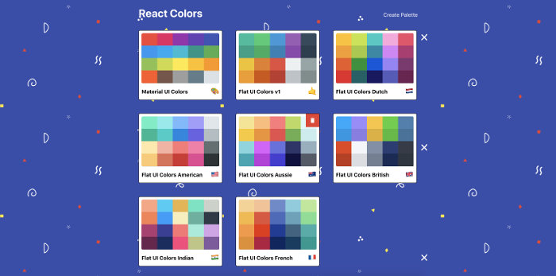
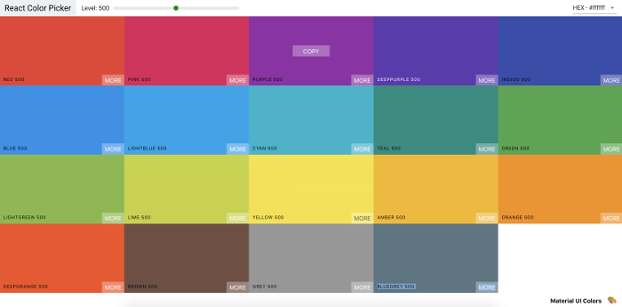
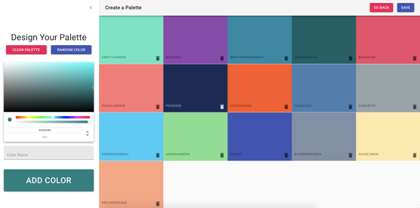

# react-color-picker

I built this website as a part of an **online course**. This course was **created** and **designed** by **Colt Steele** and can be found on [Udemy](https://www.udemy.com/modern-react-bootcamp/).

## App description

This simple application allows users to creates palettes of colors and quickly copy a color into the clipboard.

## Libraries used in this project

- [react](https://reactjs.org/) to build the user interface.
- [react-router-dom](https://github.com/ReactTraining/react-router/tree/master/packages/react-router-dom) to handle routings in the app.
- [material-ui](https://material-ui.com/) for the overall app design.
- [chroma-js](https://github.com/gka/chroma.js/) for color conversions and color scales.
- [react-color](https://github.com/casesandberg/react-color) for Color Picker.
- [react-copy-to-clipboard](https://github.com/nkbt/react-copy-to-clipboard) to copy to clipboard.
- [rc-slider](https://github.com/schrodinger/rc-slider) for the slider design and functionality.
- [emoji-mart](https://github.com/missive/emoji-mart) for emoji picker.

## Application functionalities

- **Create new palette** of colors.
- **Get** different **shades** of a selected color.
- **Copy colors** into **clipboard**.
- **Sort** colors by **dragging** and **dropping**.
- **Add random** color to palette.
- **Validate** user input.

## Screenshots

  

    
  

   
  

    
  

   
  

    
  

